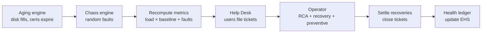

# EOS — Enterprise Operations Simulator (Phase 1 MVP)

> Build an Enterprise. Train an Operator. Replace Operations.

EOS is a **virtual enterprise you can run through time**. Real systems (SAP
modules, portals, a database, EAI, infrastructure) sit under continuous load
from AI users, while a **Chaos engine** injects sudden faults and an **Aging
engine** wears things down slowly. An **operator** — rule-based today, an LLM
agent tomorrow — has to diagnose problems, recover services, and perform
preventive maintenance. Everything it does rolls up into a single
**Enterprise Health Score (EHS)**.

This is the Phase 1 slice of the [EOS PRD](../README.md): a working, runnable,
deterministic core with no external dependencies. It is the harness that later
phases plug smarter operators into.

## Quick start

```bash
cd eos
python -m eos.cli --ticks 240 --seed 7            # 5 simulated days
python -m eos.cli --ticks 300 --no-preventive     # watch aging win
python -m eos.cli --ticks 96 --seed 7 --verbose   # per-tick trace

# tests (needs pytest)
pip install -e ".[dev]" && pytest -q
```

Sample output:

```
=== Enterprise Health Score ===
{
  "ehs": 78.24,
  "subscores": {
    "availability": 99.6, "sla": 99.6, "mttr": 41.3, "recovery": 70.3,
    "rca": 40.5, "automation": 73.1, "user": 100.0, "cost": 79.7,
    "token": 86.8, "preventive": 100.0
  }
}
```

Turning preventive maintenance **off** drops the same run from EHS ~78 to ~34
(availability 62%) — the operator's strategy visibly moves the score, which is
the whole point of the harness.

## How a tick works

One tick = 30 simulated minutes. Each tick:



Time itself drives load (PRD §11): night is quiet, business hours are busy,
and **month-end** brings a batch surge that stresses every system.

## Architecture

```
eos/
├── domain/          # what the enterprise IS
│   ├── enums.py         # systems, metrics, faults, actions, tickets
│   ├── systems.py       # System + live Metrics + health/state/SLA
│   ├── users.py         # VirtualUser (role, personality, patience)
│   └── organization.py  # Enterprise aggregate (systems + users + deps)
├── engines/         # what happens TO the enterprise
│   ├── time_engine.py   # SimClock: phases + load factor
│   ├── chaos_engine.py  # random & manual fault injection (§9)
│   └── aging_engine.py  # slow wear that spawns faults (§10)
├── ops/             # who OPERATES it
│   ├── incidents.py     # Fault + the FAULT_PROFILES registry
│   ├── helpdesk.py      # tickets: intake, classify, prioritise, route (§6)
│   └── operator.py      # RuleBasedOperator: symptom→RCA→recovery (§7)
├── metrics/
│   └── health.py        # HealthLedger → Enterprise Health Score (§15)
├── enterprise_factory.py# a default virtual petrochemical company (§3, §5)
├── simulation.py        # the tick loop that wires it all together (§14)
└── cli.py               # `python -m eos.cli`
```

### The fault registry is the single source of truth

Every failure mode is one entry in `FAULT_PROFILES` (`ops/incidents.py`) that
declares which metrics it degrades, how fast it worsens, its true root-cause
label, and which actions legitimately recover it. Chaos, Aging, and the
Operator all read from it, so **symptoms, diagnosis, and remediation can never
drift out of sync**. Add a failure mode by adding one profile.

### Root Cause + Recovery are scored separately (PRD §14)

The operator only ever sees *symptoms* (metrics, tickets, aging warnings),
never the ground-truth fault. It infers a root cause and picks a recovery
action, and the ledger scores **both**:

- **RCA accuracy** — did the diagnosis match the real fault kind?
- **Recovery rate** — did the chosen action actually fix it?

Ambiguous symptoms (many faults present as "high latency") make RCA
imperfect on purpose — that gap is the signal a better operator improves on.

## The Enterprise Health Score

Ten weighted KPIs (`metrics/health.py`), each normalised to 0–100:

| KPI | Weight | Meaning |
|-----|-------:|---------|
| Availability | 0.18 | share of system-ticks in the UP state |
| SLA | 0.14 | share meeting latency/error SLA |
| MTTR | 0.12 | mean ticks to resolve a fault (lower better) |
| Recovery | 0.12 | recovery actions that worked |
| RCA | 0.12 | correct root-cause diagnoses |
| Automation | 0.08 | faults fixed on the first attempt |
| User | 0.08 | ticket resolution speed & open-ticket pain |
| Cost | 0.06 | operational + downtime cost (lower better) |
| Token | 0.04 | operator "AI" token spend (lower better) |
| Preventive | 0.06 | aging issues headed off before they became faults |

## Plugging in your own operator

The simulator depends only on an operator exposing two methods:

```python
class MyOperator:
    def decide(self, enterprise, helpdesk, aging_warnings) -> list[Command]:
        ...   # observe metrics/tickets, return recovery/preventive Commands

    def notify_recovered(self, system_id: str) -> None:
        ...   # clear per-incident state

Simulator(build_default_enterprise(), operator=MyOperator()).run(240)
```

`RuleBasedOperator` is the reference baseline every smarter (LLM-driven,
MCP/Skill-equipped) operator in later phases is benchmarked against. Drop in an
agent that reads runbooks and calls tools, run the same seeds, and compare EHS.

## Roadmap (from the PRD)

- **Phase 1 — Virtual Enterprise** ✅ *(this MVP)*
- **Phase 2 — Enterprise Operator**: LLM/MCP operators, runbooks & docs (§12)
- **Phase 3 — Multi-Agent Operation**: specialised operators per domain (§7)
- **Phase 4 — Autonomous Enterprise**: knowledge evolution & self-learning (§13)

## Design notes

- **Deterministic**: everything is seeded; same seed → identical EHS. Tests
  rely on this.
- **No dependencies**: pure standard-library Python ≥ 3.10.
- **Small on purpose**: the default enterprise is a representative slice
  (13 systems, ~18 users), sized to run thousands of ticks instantly.
