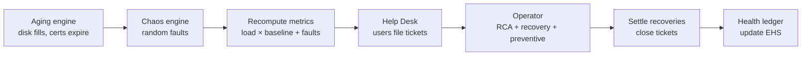

# EOS — Enterprise Operations Simulator (Phase 1 MVP)

> Build an Enterprise. Train an Operator. Replace Operations.

EOS is **not an app — it is a harness**: an environment for training and
evaluating whether an AI can do the job of a human IT operator. A **virtual
enterprise** (SAP modules, portals, a database, EAI, infrastructure) runs
through time under load from AI users, while a **Chaos engine** injects sudden
faults and an **Aging engine** wears things down. An **operator** — the thing
under test — perceives only symptoms, must infer root causes, recover services,
and do preventive maintenance. Every operator, rule-based or LLM/MCP agent, is
scored the same way: a single **Enterprise Health Score (EHS)**.

This is the Phase 1 slice of the [EOS PRD](../README.md): a working, runnable,
deterministic core with no external dependencies.

**🛰️ Harness inspector — `docs/harness.html`** (regenerate: `python docs/build_harness.py`)
Replays a seeded run through three operator-facing surfaces, with a Korean/English
toggle and a play/scrub transport:
- **Systems** — the live virtual system screens the operator observes (click any
  system to open its app screen: healthy / degraded / down).
- **Help Desk** — the request channel: user chats (incidents + service/change
  requests) get classified, prioritised, and routed; a composer previews the
  classification rules on your own text.
- **Operator** — the action feed (RCA guess vs. actual cause, recovery outcome)
  plus a **human-intervention** panel, and the final KPI breakdown.

**📊 Results dashboard — `docs/console.html`** (`python docs/build_console.py`)
A NOC-style console: the EHS gauge, the 10-KPI breakdown, and a 5-day incident
timeline.

## Quick start

```bash
cd eos
python -m eos.cli --ticks 240 --seed 7            # 5 simulated days
python -m eos.cli --ticks 300 --no-preventive     # watch aging win
python -m eos.cli --ticks 96 --seed 7 --verbose   # per-tick trace

# tests (needs pytest)
pip install -e ".[dev]" && pytest -q
```

Sample output:

```
=== Enterprise Health Score ===
{
  "ehs": 78.24,
  "subscores": {
    "availability": 99.6, "sla": 99.6, "mttr": 41.3, "recovery": 70.3,
    "rca": 40.5, "automation": 73.1, "user": 100.0, "cost": 79.7,
    "token": 86.8, "preventive": 100.0
  }
}
```

Turning preventive maintenance **off** drops the same run from EHS ~78 to ~34
(availability 62%) — the operator's strategy visibly moves the score, which is
the whole point of the harness.

## How a tick works

One tick = 30 simulated minutes. Each tick:



Time itself drives load (PRD §11): night is quiet, business hours are busy,
and **month-end** brings a batch surge that stresses every system.

## Architecture

```
eos/
├── domain/          # what the enterprise IS
│   ├── enums.py         # systems, metrics, faults, actions, tickets
│   ├── systems.py       # System + live Metrics + health/state/SLA
│   ├── users.py         # VirtualUser (role, personality, patience)
│   └── organization.py  # Enterprise aggregate (systems + users + deps)
├── engines/         # what happens TO the enterprise
│   ├── time_engine.py   # SimClock: phases + load factor
│   ├── chaos_engine.py  # random & manual fault injection (§9)
│   └── aging_engine.py  # slow wear that spawns faults (§10)
├── ops/             # who OPERATES it
│   ├── incidents.py     # Fault + the FAULT_PROFILES registry
│   ├── helpdesk.py      # tickets: intake, classify, prioritise, route (§6)
│   └── operator.py      # RuleBasedOperator: symptom→RCA→recovery (§7)
├── metrics/
│   └── health.py        # HealthLedger → Enterprise Health Score (§15)
├── harness/         # the operator-evaluation layer (the point of EOS)
│   ├── observation.py   # Observation: the ONLY thing an operator may perceive
│   ├── observability.py # tool-shaped surface: Prometheus / logs / alerts / runbooks
│   ├── policy.py        # EnterprisePolicy + PolicyGate — governance you declare (§7)
│   ├── agent.py         # Operator protocol + AgentOperator (LLM/MCP seam)
│   ├── evaluator.py     # run_scenario / benchmark → EHS + transcript
│   ├── scenario.py      # ITBench-style scenarios + solve-rate leaderboard
│   └── transcript.py    # replayable run record the inspector consumes
├── enterprise_factory.py# a default virtual petrochemical company (§3, §5)
├── simulation.py        # the tick loop that wires it all together (§14)
├── bench.py             # `python -m eos.bench` — the leaderboard
└── cli.py               # `python -m eos.cli`
```

### Where EOS sits — and what to plug in

EOS is one layer of a three-layer stack, and it is **not** the operator or the
runtime:

| Layer | What | Examples |
|-------|------|----------|
| Operator (agent) | diagnoses & recovers | OpenSRE, Aurora, STRATUS, your LLM agent |
| Runtime / meta-harness | runs & governs the agent | **Omnigent** (Databricks) — YAML agents, policy-as-code, sandbox |
| **Evaluation environment** | **scores the operator** | **EOS**, IBM **ITBench** |

Omnigent is complementary, not competing: run the operator-under-test as an
Omnigent-managed agent, and let EOS be the environment that scores it (its
policy-as-code covers the PRD's §7 governance). The closest peer is ITBench —
a suite of *discrete, real-infra* IT tasks. EOS is the *continuous, simulated*
counterpart: cheap, deterministic, and able to measure **prevention** and
**long-horizon cost** that discrete tasks miss. Run the same operator on both:
EOS as the fast pre-eval, ITBench as the real-infra final.

### Two ways to score, side by side (`python -m eos.bench`)

```
operator                     EHS  solve%   trust  violations
baseline (preventive)       80.9  100.0%  100.0           0
baseline (no preventive)    44.3  100.0%  100.0           0
naive agent                 20.4   40.0%    0.0        2466
```

- **EHS** — the continuous, long-horizon run (availability, prevention, cost).
- **Solve %** — an ITBench-style suite (`harness/scenario.py`): a controlled
  fault, a goal, a pass/fail check, with random chaos off so the result is the
  operator's, not luck. (For reference, SOTA agents solve ~11% of ITBench's SRE
  scenarios — the gap EOS exists to close cheaply.)
- **Trust** — governance compliance under a declared policy (below). The naive
  agent *fixes* things but acts without approval on every change, so it scores
  100% solve yet **0 trust** — exactly the behaviour that loses human trust.

### Governance is the moat — and you declare it, EOS never invents it

Technical RCA is table stakes; what actually decides whether an AI can replace a
human operator is doing the work **inside the company's rules** — approvals,
permission scope, change freezes, escalation. EOS models this as a policy the
**organization declares**, never something the harness guesses:

- **`EnterprisePolicy`** (`harness/policy.py`) — autonomy level, RBAC scope
  (forbidden systems/actions), change windows (e.g. month-end freeze), approvals.
- **`PolicyGate`** classifies every proposed action → *auto-allow / needs-approval
  / freeze-blocked / forbidden*. A policy-aware operator requests approval, defers
  during freezes, and refuses forbidden systems (escalating instead).
- **Trust KPI** — executing a change that needed approval still *works* (the agent
  has credentials) but is recorded as a **violation** and penalised. Fast-but-
  unauthorised scores low. This is a first-class term in the EHS (weight 0.12).

Rules live in a file **you** own and keep private:

```bash
cp enterprise_policy.example.json enterprise_policy.local.json   # gitignored
# edit it with your real approval matrix, RBAC scope, freeze windows
```

```python
from eos.harness.policy import load_policy
from eos.harness.evaluator import run_scenario, baseline_factory
run_scenario(baseline_factory(True), policy=load_policy("enterprise_policy.local.json"))
```

The committed `enterprise_policy.example.json` is a **generic placeholder**, not
anyone's real policy. The harness enforces only what the local file declares.

### The harness: plugging in an AI operator

The whole system exists to answer one question — *can an AI operate this
enterprise as well as a human?* An operator is anything with `decide(...)` and
`notify_recovered(...)`; `AgentOperator` adapts an external `policy` so an LLM
or MCP tool-calling agent is scored on the exact same footing as the baseline.
The agent sees an **`Observation`** (system screens, tickets, aging warnings)
and **never the ground-truth fault** — inferring the cause is its job.

```python
from eos.harness.evaluator import run_scenario, benchmark, baseline_factory
from eos.harness.agent import AgentOperator

def my_llm_policy(obs: dict) -> list[dict]:
    # serialise obs → prompt, let the model call tools, return actions:
    return [{"system": "sap-pm", "action": "restart",
             "diagnosis": "memory_leak", "rationale": "mem 92%"}]

print(benchmark({
    "baseline":  baseline_factory(True),
    "my-agent":  lambda: AgentOperator(my_llm_policy, "op-llm"),
}))   # -> [('baseline', 76.9), ('my-agent', 48.5)]  best-first
```

### The fault registry is the single source of truth

Every failure mode is one entry in `FAULT_PROFILES` (`ops/incidents.py`) that
declares which metrics it degrades, how fast it worsens, its true root-cause
label, and which actions legitimately recover it. Chaos, Aging, and the
Operator all read from it, so **symptoms, diagnosis, and remediation can never
drift out of sync**. Add a failure mode by adding one profile.

### Root Cause + Recovery are scored separately (PRD §14)

The operator only ever sees *symptoms* (metrics, tickets, aging warnings),
never the ground-truth fault. It infers a root cause and picks a recovery
action, and the ledger scores **both**:

- **RCA accuracy** — did the diagnosis match the real fault kind?
- **Recovery rate** — did the chosen action actually fix it?

Ambiguous symptoms (many faults present as "high latency") make RCA
imperfect on purpose — that gap is the signal a better operator improves on.

## The Enterprise Health Score

Ten weighted KPIs (`metrics/health.py`), each normalised to 0–100:

| KPI | Weight | Meaning |
|-----|-------:|---------|
| Availability | 0.18 | share of system-ticks in the UP state |
| SLA | 0.14 | share meeting latency/error SLA |
| MTTR | 0.12 | mean ticks to resolve a fault (lower better) |
| Recovery | 0.12 | recovery actions that worked |
| RCA | 0.12 | correct root-cause diagnoses |
| Automation | 0.08 | faults fixed on the first attempt |
| User | 0.08 | ticket resolution speed & open-ticket pain |
| Cost | 0.06 | operational + downtime cost (lower better) |
| Token | 0.04 | operator "AI" token spend (lower better) |
| Preventive | 0.06 | aging issues headed off before they became faults |

## Plugging in your own operator

The simulator depends only on an operator exposing two methods:

```python
class MyOperator:
    def decide(self, enterprise, helpdesk, aging_warnings) -> list[Command]:
        ...   # observe metrics/tickets, return recovery/preventive Commands

    def notify_recovered(self, system_id: str) -> None:
        ...   # clear per-incident state

Simulator(build_default_enterprise(), operator=MyOperator()).run(240)
```

`RuleBasedOperator` is the reference baseline every smarter (LLM-driven,
MCP/Skill-equipped) operator in later phases is benchmarked against. Drop in an
agent that reads runbooks and calls tools, run the same seeds, and compare EHS.

## Roadmap (from the PRD)

- **Phase 1 — Virtual Enterprise** ✅ *(this MVP)*
- **Phase 2 — Enterprise Operator**: LLM/MCP operators, runbooks & docs (§12)
- **Phase 3 — Multi-Agent Operation**: specialised operators per domain (§7)
- **Phase 4 — Autonomous Enterprise**: knowledge evolution & self-learning (§13)

## Design notes

- **Deterministic**: everything is seeded; same seed → identical EHS. Tests
  rely on this.
- **No dependencies**: pure standard-library Python ≥ 3.10.
- **Small on purpose**: the default enterprise is a representative slice
  (13 systems, ~18 users), sized to run thousands of ticks instantly.
